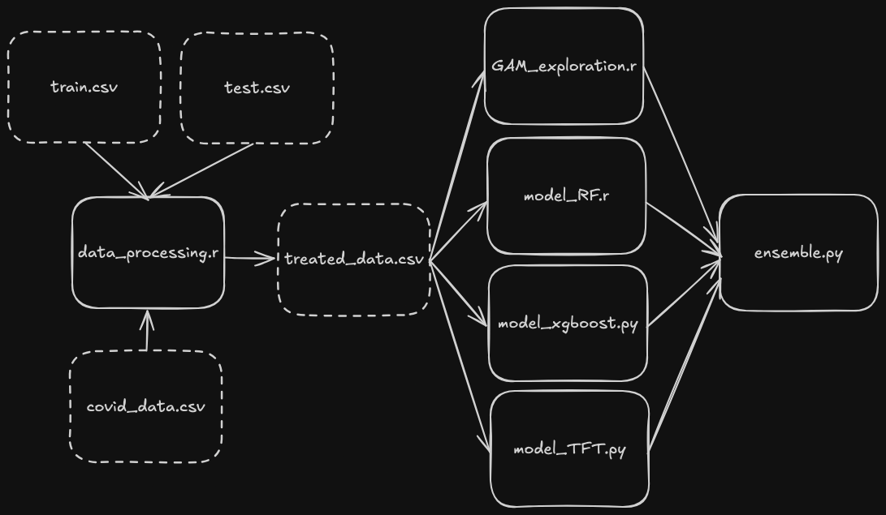

Repository for the Kaggle competition [Net-Load Forecasting During the "Soberty" Period](https://www.kaggle.com/competitions/net-load-soberty-period)

# Characteristics
- Data
    - Daily electricity (consumption, production) and weather data from 2013 to mid-2023.
- Goal
    - Forecast the Net demand from mid-2022 to mid-2023
- Evaluation Metric
    - The evaluation metric for this competition is the pinball loss score for quantile 0.8

# Overview
Electricity demand forecasting is crucial to reduce the operational costs of power providers, especially when relying on intermittent sustainable energy sources.

Both demand and supply characteristics evolve over time. On the demand side, unexpected events as well as longer-term changes in consumption habits affect demand patterns. Recently, massive savings have been observed in Europe, following an unprecedented rise of energy prices.

On the production side, the increasing penetration of intermittent power generation significantly changes the forecasting needs.

This challenge addresses this problem. You will need to develop adaptive forecasting tools to adapt to these changes.
